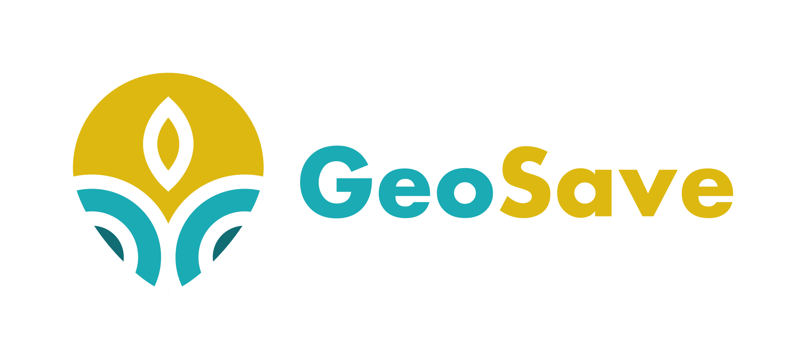

# GeoSave

<h1 align=center>

</h1>

Android app that will allow for easy sharing and collaborating on GPS related data & location pictures. Target group are primarily biologists, geologists, mushroom pickers, etc.

status: in-dev

My personal goals with this project are to practice Firebase services integration and in the future create IOS and web versions of this app.

## Contributing guide / API keys

[https://github.com/jakdor/geosave/CONTRIBUTING.md](CONTRIBUTING.md)

## Licence

    GeoSave - app for easy sharing and collaborating on GPS related data
    Copyright (C) 2018  Jakub Dorda

    This program is free software: you can redistribute it and/or modify
    it under the terms of the GNU General Public License as published by
    the Free Software Foundation, either version 3 of the License, or
    (at your option) any later version.

    This program is distributed in the hope that it will be useful,
    but WITHOUT ANY WARRANTY; without even the implied warranty of
    MERCHANTABILITY or FITNESS FOR A PARTICULAR PURPOSE.  See the
    GNU General Public License for more details.

    You should have received a copy of the GNU General Public License
    along with this program.  If not, see <http://www.gnu.org/licenses/>.
